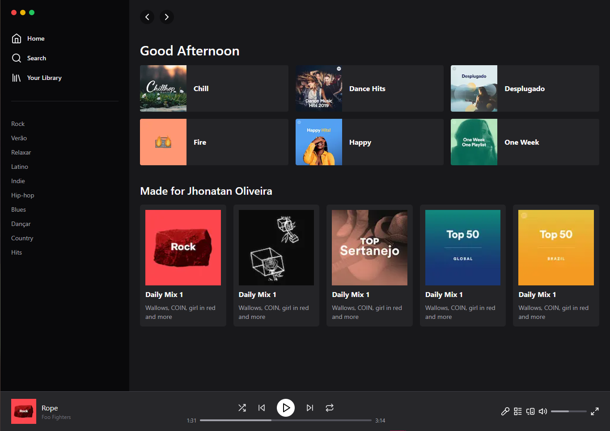

<div align="center">
<h1 align="center">🎶Spotify Clone UI<br> made With Next and Tailwind CSS ⚛</h1>

</div>

&nbsp;

<p align="center">
  <a href="#Technologies">Technologies</a>&nbsp;&nbsp;&nbsp;|&nbsp;&nbsp;&nbsp;
  <a href="#Project">Project</a>&nbsp;&nbsp;&nbsp;|&nbsp;&nbsp;&nbsp;
  <a href="#License">License</a>
</p>

<p align="center">
 
  
  
</p>

<p align="center">
    
</p>

<br>

# 📄 Description

### What is this project? 📝

- The project aims to create a clone of the Spotify interface using Next.js and Tailwind CSS. The goal is to replicate the interface of the Spotify web application, only to show the power of Taildwind CSS. The project will be built using Next.js, a popular React framework for building server-side rendered web applications, and Tailwind CSS, a utility-first CSS framework that enables rapid UI development.

# 🚀 Technologies

- This project was developed with the following technologies:

### React 📝

### Next.js 📝

### Tailwind CSS 📝

### TypeScript 📝

### Lucide Icons 📝

How to run:

```bash

# Clone Repository

$ git clone

# Go to folder

$ cd spotify_next_tailwindcss

# Install Dependencies

$ yarn or npm install

# Run Aplication

$ yarn dev or npm run dev

```

# 🚧 Project

### [Live project!](https://) 🚀

# 🎨 Inspiration

- [Spotify](https://www.spotify.com/br/)

- [Recriei a interface do Spotify usando Tailwind](https://www.youtube.com/watch?v=YVI-q3idGiM)

# 📝 License

This is a project made for stidy proposes only.

<hr>

<p align="center">Made by <a href="https://jhonatanoliveira.com/" target="_blank">Jhonatan Oliveira</a>.</p>